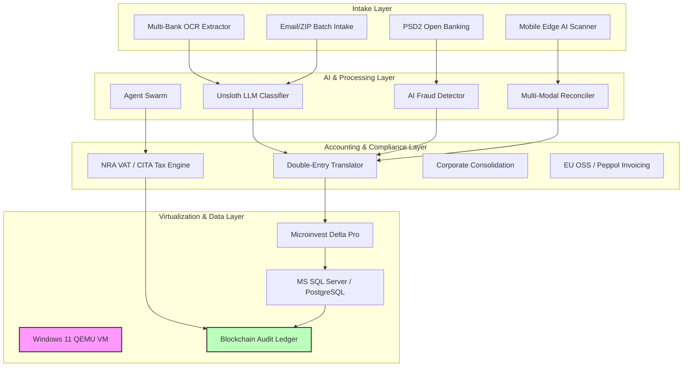

# FinansProtect — Enterprise Accounting Automation Platform
### Portable Windows 11 QEMU Virtual Machine (Microinvest Delta Pro)

[](LICENSE)
[]()
[]()
[]()

**FinansProtect** is a massive, enterprise-grade accounting automation platform designed to fully automate Bulgarian double-entry bookkeeping, multi-bank statement processing, OCR extraction, tax compliance, and multi-entity corporate consolidation. At its core, it leverages an automated, zero-config, portable Windows 11 virtual machine launcher for QEMU on macOS and Linux, executing Microinvest Delta Pro natively.

---

## 🌟 Feature Highlights (Ключови Функционалности)

FinansProtect integrates over 67+ autonomous modules, categorized into the following core domains:

### 🔍 OCR & Document Processing
- **PDF OCR & Multi-Bank Extractors**: Automatic parsing of bank statements from DSK, UniCredit, UBB, and Postbank.
- **Image Preprocessing**: Adaptive contrast, sharpness, median noise reduction, and binarization for low-quality scans.
- **Edge AI Mobile Scanner**: Local WebAssembly/On-Device OCR scanning for fiscal receipts (фискални бонове) with NRA QR parsing and offline sync.

### 📊 Bulgarian Double-Entry Accounting (Двустранно Счетоводство)
- **Chart of Accounts Mapping**: Intelligent mapping to the Bulgarian National Chart of Accounts (Сметкоплан) - e.g., 503, 401, 411, 501, 621.
- **Transaction Translation Engine**: Full generation of double-entry journal records and Microinvest TransferData XML.
- **Delta Pro Automated Import**: VNC & PowerShell Base64 automation interacting with Microinvest Delta Pro inside the QEMU VM.

### 🏦 Banking Integration
- **PSD2 Open Banking (PISP/AISP)**: Automated vendor invoice payments (401/503) and multi-bank balance aggregation.
- **SEPA Instant & BISERA 6**: Sub-second instant settlement ingestion and vendor invoice resolution.
- **Real-Time Reconciliation Guard**: Continuous bank feed matching against Account 503, unposted fee detection, and variance guards.

### 🧾 Tax & Compliance (Данъци и Съответствие)
- **NRA VAT Reporting**: Automated E-Reporting for statutory NRA text files (`DEKLAR.TXT`, `POKUPKI.TXT`, `PRODAGBI.TXT`).
- **CITA Tax Returns**: 10% corporate tax calculation, 609 adjustments, and Art. 92 CITA returns.
- **VIES & EU OSS**: EU VAT rate calculation and validation via European Commission VIES API.
- **OECD SAF-T**: SAF-T v2.0 XML audit files for Bulgarian National Revenue Agency (НАП) compliance.
- **Dividend & Customs Tax**: Autonomous dividend withholding (Art. 194 CITA) and Customs/Excise tax accounting.

### 🤖 AI & Machine Learning
- **Unsloth LLM Fine-Tuning**: Llama-3.2 fine-tuned on 1,000+ Bulgarian bank transaction narratives for accurate account classification.
- **Fraud Prevention**: Real-time anomaly detection for unverified IBAN changes, duplicate invoices, and monetary amount spikes.
- **Cash Flow Forecasting**: Monte Carlo liquidity simulations and 30/60/90-day predictive liquidity engine.
- **Agent Swarm & Voice Assistant**: 24/7 autonomous cognitive AI agents and speech-to-text (STT) Bulgarian voice queries.

### 🔒 Security (Сигурност)
- **Zero-Trust HSM & Post-Quantum Signer**: PKCS#11 / YubiKey signatures and NIST Post-Quantum Cryptography (PQC) for audit logs.
- **Audit Ledger Integrity Guard**: Tamper-evident SHA-256 hash chaining of accounting entries for 100% NRA tax audit protection.
- **Multi-Tenant Isolation & RBAC**: Multi-company data isolation and JWT role-based access control.
- **eIDAS 2.0 Compliance Vault**: RFC 3161 timestamps and ZK tax audit proofs.

### 🌐 Integration
- **Peppol EU E-Invoicing**: Peppol BIS Billing v3.0 UBL v2.1 XML generation.
- **Telegram & Mobile Push**: Real-time Telegram and native mobile alerts for HA failover and audit discrepancies.
- **Obsidian & Supabase**: Markdown accounting notes sync and Supabase database logging.

### ⚡ Infrastructure
- **High Availability (HA) Clustering**: Multi-node HA cluster management with automatic leader election and failover.
- **Active-Active SQL Sync**: Zero RPO bi-directional replication between MS SQL Server and PostgreSQL.
- **Zero-Downtime Rolling Upgrades**: Canary and blue/green container deployments across HA nodes.
- **Prometheus & Grafana**: Exposing telemetry for financial turnover, transaction volume, and OCR precision.

---

## 🏛️ Architecture Diagram



---

## 🚀 Quick Start for Accounting

To initialize the FinansProtect accounting ecosystem on top of your configured QEMU environment:

### 1. Start the Docker Infrastructure
```bash
./scripts/deploy_production_stack.sh
```
This launches the multi-node container stack including the Web UI Dashboard, Prometheus telemetry, Infisical Vault, and n8n webhooks.

### 2. Access the FinansProtect Dashboard
Navigate to `http://localhost:8095` to view the real-time visual monitoring dashboard for bank statement intake queues, processed turnover, and SHA-256 audit integrity logs.

### 3. Process a Batch of Statements
You can trigger the multi-PDF batch processing queue by placing files in the designated intake folder or using the API:
```bash
curl -X POST http://localhost:8080/process-batch -d '{"source": "/data/intake"}'
```

---

## 📂 Module Index

The project is structured into specialized autonomous domains within `src/`:

| Module Directory | Primary Responsibility |
|------------------|------------------------|
| `src/intake/` | Open Banking (PSD2, SEPA Instant), Bank feed syncing, Email and webhook ingestion. |
| `src/security/` | HSM and Post-Quantum cryptographic signing, Audit Ledger hashing, RBAC, eIDAS Vault. |
| `src/accounting/` | Core double-entry mapping, Payroll, Inventory, Cash Desk, Fixed Assets, Corporate consolidation. |
| `src/audit/` | NRA VAT reporting, SAF-T exports, CITA/Dividend tax generation, Global tax engines. |
| `src/ai/` | Unsloth fine-tuning, Fraud detection, Cash flow forecasting, AI Agent Swarm, Voice assistant. |
| `src/dashboard/` | Real-time web UI dashboard, Executive briefing generation, Prometheus telemetry. |
| `src/backup/` | Active-Active SQL sync, Disaster recovery replication, Cold storage archiving. |
| `src/cluster/` | High availability (HA) failover, Rolling upgrades, Quantum-safe K3s mesh orchestrator. |
| `src/integration/` | Peppol e-invoicing, NRA portal gateway, Telegram/Mobile push alerts, Supabase, Obsidian. |
| `src/ocr/` | Edge AI mobile scanner, Image preprocessor, Multi-bank PDF extractors, Batch processing. |
| `src/vm_automation/`| VNC & PowerShell Base64 scripts for Microinvest Delta Pro interaction inside QEMU. |

---

## 🧪 Test Suite

The platform maintains strict stability through comprehensive testing:
- **420 automated tests** across **85 test files**.
- Fully autonomous End-to-End (E2E) testing encompassing OCR ingestion through double-entry database insertion and final audit log generation.

Run the full test suite using:
```bash
pytest tests/
```

---

## 🖥️ Windows 11 QEMU Virtual Machine

### 📋 Overview & Problem Resolution Summary

#### The Problem
During initial Windows 11 setup on virtual drives, users frequently encounter disk partition errors such as:
> **"Windows 11 не може да се инсталира на диск 0 дял 3."** (*Windows 11 cannot be installed to Disk 0 Partition 3*)

Additionally, standard Windows 11 installer ISOs block installation on virtual machines lacking hardware TPM 2.0, Secure Boot, 64 GB disk space, or 4 GB+ RAM.

#### Root Causes
1. **Disk Size & Partition Schema**: Windows 11 requires a minimum disk space of 52-64 GB. When installed on smaller VHDX/QCOW2 images (e.g. 40 GB), Windows Setup fails at partition creation.
2. **Hardware Requirement Checks**: WinPE verifies hardware compliance before allowing partition selection.
3. **Online Account Enforcement**: Windows 11 OOBE setup forces a network connection and Microsoft account login.

#### The Solution Architecture
- **Dynamic 64 GB QCOW2 Storage**: Allocates a dynamic `windows11_portable.qcow2` image (starts at <10 MB, expands up to 64 GB on demand).
- **Automated WinPE Bypass ISO (`autounattend.iso`)**: Generates a secondary ISO containing `autounattend.xml`. During boot, WinPE automatically executes registry commands under `HKLM\SYSTEM\Setup\LabConfig` before compliance checks run:
  - `BypassTPMCheck = 1`
  - `BypassSecureBootCheck = 1`
  - `BypassRAMCheck = 1`
  - `BypassStorageCheck = 1`
  - `BypassCPUCheck = 1`
  - `BypassNRO = 1` (Bypasses network requirement, enabling local account setup)
- **AHCI SATA Controller Setup**: Configures ide-hd on `ahci0.0` for maximum compatibility across macOS and Linux hosts.

### 🚀 QEMU Quick Start Guide

#### 1. Prerequisites
Ensure `qemu` and ISO generation tools are installed:

**On macOS:**
```bash
brew install qemu
```

**On Linux (Ubuntu / Debian / Fedora / Arch):**
```bash
# Ubuntu / Debian
sudo apt update && sudo apt install qemu-system-x86 qemu-utils genisoimage

# Fedora
sudo dnf install qemu-system-x86 qemu-img genisoimage

# Arch Linux
sudo pacman -S qemu-desktop xorriso
```

#### 2. Clone Repository
```bash
git clone https://github.com/finansovazashtita-arch/portable-windows-11-qemu.git
cd portable-windows-11-qemu
```

#### 3. Add Windows 11 ISO
Place your official Windows 11 ISO in the project directory renamed to `Win11_x64.iso` (or set `WIN11_ISO=/path/to/your/iso`).

#### 4. Launch the Virtual Machine

**On macOS:**
```bash
./start_qemu_mac.sh
```

**On Linux:**
```bash
./start_qemu_linux.sh
```

### ⚙️ Detailed Step-by-Step Technical Guide

#### Step 1: Generating the Unattend Hardware Bypass ISO
`autounattend.xml` contains synchronous commands executed during the `windowsPE` configuration pass:
```xml
<?xml version="1.0" encoding="utf-8"?>
<unattend xmlns="urn:schemas-microsoft-com:unattend">
    <settings pass="windowsPE">
        <component name="Microsoft-Windows-Setup" processorArchitecture="amd64" publicKeyToken="31bf3856ad364e35" language="neutral" versionScope="nonSxS">
            <RunSynchronous>
                <RunSynchronousCommand wcm:action="add">
                    <Order>1</Order>
                    <Path>cmd /c reg add HKLM\SYSTEM\Setup\LabConfig /v BypassTPMCheck /t REG_DWORD /d 1 /f</Path>
                </RunSynchronousCommand>
                <RunSynchronousCommand wcm:action="add">
                    <Order>2</Order>
                    <Path>cmd /c reg add HKLM\SYSTEM\Setup\LabConfig /v BypassSecureBootCheck /t REG_DWORD /d 1 /f</Path>
                </RunSynchronousCommand>
                <RunSynchronousCommand wcm:action="add">
                    <Order>3</Order>
                    <Path>cmd /c reg add HKLM\SYSTEM\Setup\LabConfig /v BypassRAMCheck /t REG_DWORD /d 1 /f</Path>
                </RunSynchronousCommand>
                <RunSynchronousCommand wcm:action="add">
                    <Order>4</Order>
                    <Path>cmd /c reg add HKLM\SYSTEM\Setup\LabConfig /v BypassStorageCheck /t REG_DWORD /d 1 /f</Path>
                </RunSynchronousCommand>
                <RunSynchronousCommand wcm:action="add">
                    <Order>5</Order>
                    <Path>cmd /c reg add HKLM\SYSTEM\Setup\LabConfig /v BypassCPUCheck /t REG_DWORD /d 1 /f</Path>
                </RunSynchronousCommand>
                <RunSynchronousCommand wcm:action="add">
                    <Order>6</Order>
                    <Path>cmd /c reg add HKLM\SOFTWARE\Microsoft\Windows\CurrentVersion\OOBE /v BypassNRO /t REG_DWORD /d 1 /f</Path>
                </RunSynchronousCommand>
            </RunSynchronous>
            <UserData>
                <AcceptEula>true</AcceptEula>
            </UserData>
        </component>
    </settings>
</unattend>
```

Build the ISO manually if needed:
```bash
./create_autounattend_iso.sh
```

#### Step 2: Creating the Dynamic 64GB QCOW2 Hard Disk
```bash
./create_qcow2_disk.sh windows11_portable.qcow2 64G
```

#### Step 3: Windows 11 Automated Setup Flow
1. Boot QEMU VM.
2. Windows Setup automatically loads `autounattend.xml` from secondary CD-ROM.
3. Select Language & Edition (e.g. Windows 11 Pro).
4. Unallocated 64.0 GB Disk 0 will display without hardware warnings.
5. Confirm installation onto Disk 0.
6. Installation completes file expansion (100%), reboots off disk, completes first-boot initialization, and enters OOBE.
7. In OOBE network screen, select **"I don't have internet"** (`Нямам интернет`) to create a local user account.

### 🧪 Isolated Environment Verification Suite

To verify that the project works out-of-the-box for open-source clients on a clean machine:
```bash
./test_isolated_environment.sh
```

Expected Output:
```text
==========================================================
      OPEN-SOURCE AUTOMATED ENVIRONMENT VERIFICATION     
==========================================================
[TEST 1/5] Validating autounattend.xml syntax...
  -> [PASSED] autounattend.xml contains all 6 required bypass directives.
[TEST 2/5] Testing ISO build script in isolated environment...
  -> [PASSED] Generated autounattend.iso (921600 bytes).
[TEST 3/5] Testing QCOW2 dynamic disk generation...
  -> [PASSED] Virtual disk generated: file format: qcow2
[TEST 4/5] Checking QEMU executable binary...
  -> [PASSED] Found QEMU binary: QEMU emulator version 11.0.3
[TEST 5/5] Checking launcher scripts permissions and syntax...
  -> [PASSED] Shell script syntax checks clean.
==========================================================
  [SUCCESS] All isolated environment tests PASSED!        
==========================================================
```

---

## 📄 License
This project is licensed under the [MIT License](LICENSE).
